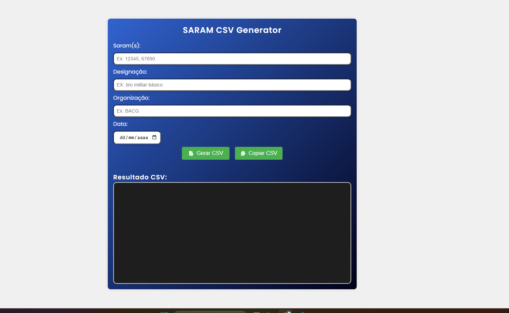

# SARAM CSV Generator

## 🎯 Objetivo

Desenvolvi esta ferramenta web para facilitar atividades do meu trabalho atual, automatizando processos repetitivos relacionados à geração de arquivos CSV promovendo mais agilidade e padronização.
Além disso, o desenvolvimento da ferramenta também contribuiu para o meu aprimoramento prático em HTML5, CSS3 e JavaScript.

## 🚀 Funcionalidades

- Geração automática de CSV
- Cópia automática do CSV com um clique
- Suporte a múltiplos SARAMs
- Interface moderna
- Validação de campos
- Formatação automática de data

## 🛠 Tecnologias

- HTML5
- CSS3
- JavaScript

## 📸 Preview

## 📋 Como usar

1. Digite os SARAMs separados por vírgula
2. Preencha os demais campos
3. Clique em "Gerar CSV"
4. Utilize o botão "Copiar CSV" para copiar o conteúdo gerado

## 👨‍💻 Autor

Guilherme Eduardo R. Alves Ribeiro
